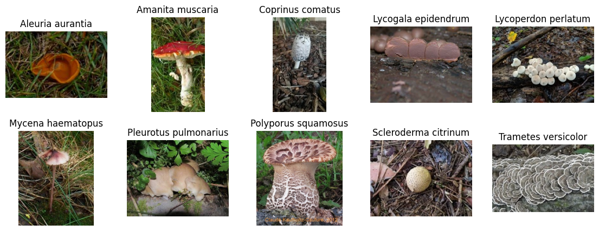
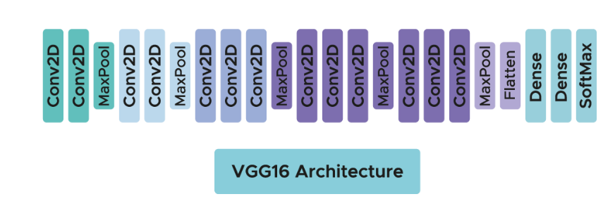
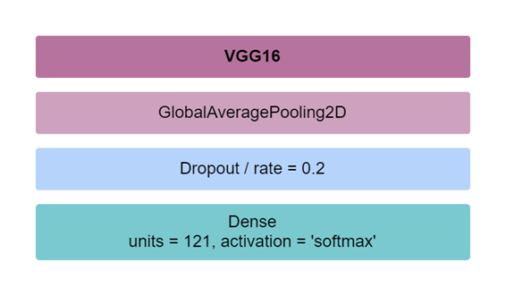
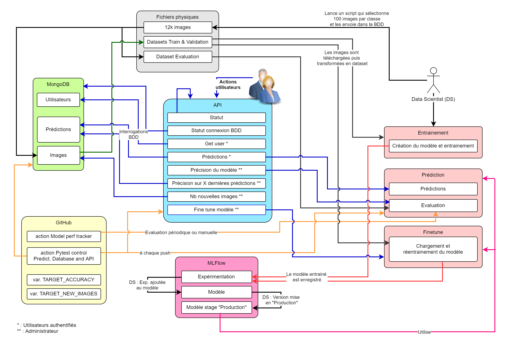

# Documentation du projet MLOps_ChampiPy

## ChampiPy

ChampiPy est projet de Deep Learning permettant d’obtenir le nom d’une espèce de champignon grâce à une photo.
Le modèle a été réalisée dans le cadre de la formation Data Scientist de Janvier 2022 par Romain COUSSY, Emeline SILVESTRE, Paul VENTURA et moi-même.

L'objectif (simulé) maintenant est de mettre ce modèle à disposition d'un groupe d'utilisateur confirmés sur https://mushroomobserver.org/ afin de vérifier les propositions des utilisateurs moins expérimentés.
Plus particulièrement, à partir de l'URL d'une image, le modèle prédira l'espèce et indiquera le pourcentage de précision de cette prédiction.
L'utilisateur à l'origine de cette demande, Bob, sera également l'administrateur de l'application.
L'exploitation du ce modèle se fera, dans un premier temps, par l'intermédiaire d'une API.

Le jeu de données est composé des 1.000 images réparties en 10 espèces de champignons :


## Architecture des dossiers

### **app**
Fichiers de l'API organisés de la manière suivante :
<ul>
    <li><b>api</b> : corps de l'API</li>
    <li><b>database</b> : fichiers relatifs à la partie BDD</li>
    <li><b>predict</b> : modèles, codes et fichiers relatifs aux prédictions</li>
        <ul>
            <li><b>images_eval</b> : images source du dataset d'évaluation</li>
            <li><b>images_temp</b> : dernières 1.000 images téléchargées de la BDD</li>
            <li><b>mlruns</b> : dossier MLFlow contenant les différents modèles</li>
        </ul>
    <li>requirements.txt : librairies du projet</li>
</ul>

### **docker_image**
Ressources nécessaires à la création du container de l'application.

Pour le créer :

<ol>
    <li>Téléchargez le projet et placez vous dans le dossier <code>./docker_image/</code></li>
    <li>Lancez setup.sh (linux) ou setup.cmd (windows)</li>
</ol>

### **docs**
Fichiers de documentation, dont le cahier des charges et des images d'illustration

### **test**
Dossier contenant les scripts à utiliser avec PyTest : database_test.py et predict_test.py

### **.github/workflows**
Dossier contenant le code des GitHub Actions

## Usage
Lancement de l'API :

A la racine du projet, lancez :
>```uvicorn app.api.main:api --reload```

[Lien vers la documentation de l'API](http://localhost:8000/docs)

Lancement de MLFlow :

Placez vous dans le dossier <code>/app/predict</code> puis
>```mlflow ui```

[Lien vers MLFlow](http://localhost:5000)

## Test
Lancement des tests via pytest :

>```python -m pytest test\database_test.py```

>```python -m pytest test\predict_test.py```

>```python -m pytest test\api_test.py -W ignore::DeprecationWarning```

>```python -m pytest test\api_test_perf.py -W ignore::DeprecationWarning```

## Détail des parties

### Base de données
La base de données est stockée sur le cloud de MongoDB.
Elle est composée des collections **users**, **predictions**, **parameters** et d'un [GridFS](https://www.mongodb.com/docs/manual/core/gridfs/) pour stocker les images.

MongoDB permet de stocker les données sous forme de documents et est très flexible. Cette flexibilité est bienvenue lorsque la base se transforme au fil des étapes du projet notamment pour trouver la manière la plus économique en bande passante et rapide de stocker et récupérer les images.

Lors de l'entrainement ou réentrainement d'un modèle, les 1000 dernières images sont téléchargées de la base de données vers la machine qui lance cette opération.

### Fonctionnement du modèle
Le modèle est basé sur VGG16 avec 3 couches supplémentaires. Il est un bon compromis entre rapidité d'entrainement et précision de prédiction.




L'entrainement du modèle est lancé manuellement via le script ```./app/predict/train.py```, les paramètres sont modifiables à l'intérieur de celui-ci. Le modèle est enregistré dans MLFlow, dans l'expérimentation **mlops_project**.

Après avoir rattaché cette expérimentation au modèle VGG16, il est possible de lui attribuer une étape.
Les fonctions de prédiction et de fine tuning se basent sur le modèle d'étape **production**, ces étapes sont directement accessibles via l'API.

Le fine tuning crée une expérimentation également.

### Gestion de l'API
L'API est composée de 3 parties :

#### Fonctions générales
| **Nom** | **Description** | **Accès** |
| --- | --- | --- |
| status | Etat de l'API<br>Paramètres : Non | Tout le monde |
| dbconnex | Etat de la connexion à la base de données<br>Paramètres : Non | Tout le monde |
| user | Indique le nom de l'utilisateur s'il est authentifié<br>Paramètres : Non | Utilisateurs authentifiés |

#### Prédictions
| **Nom** | **Description** | **Accès** |
| --- | --- | --- |
| predictions | Effectuer une prédiction et obtenir un ou plusieurs résultats<br>Paramètres : <br><ul><li>**File** : adresse d'une image</li><li>**Nb_preds** : nombre de résultats attendu</li></ul> | Utilisateurs authentifiés |

Les prédictions sont stockées dans la base de données pour une réutilisation du résultat si la même image est utilisée et les images ayant une précision > 70% sont enregistrées dans la base pour servir au réentrainement du modèle

#### Fonctions de supervision
| **Nom** | **Description** | **Accès** |
| --- | --- | --- |
| accuracy | Evalue la précision du modèle<br>Paramètres : Non	| Administrateur |
| past_pred_acc | Affiche la moyenne de précision des X dernières prédictions<br>Paramètres : <ul><li>**Nb_last_preds** : nombre de prédictions à prendre en compte</li></ul> | Administrateur |
| nb_new_img | Affiche le nombre d'image ajoutées à la DBB depuis la mise en production du modèle<br>Paramètres :<br><ul><li>**Model_name** : nom du modèle</li><li>**Stage** : stage du modèle</li></ul> | Administrateur
| finetune | Effectuer une optimisation des hyperparamètres<br>Paramètres :<br><ul><li>**Model_name** : nom du modèle</li><li>**Stage** : stage du modèle</li><li>**Variables** : nombre de couches du modèle à entrainer</li><li>**Epochs** : nombre d'époque de l'entrainement | Administrateur |

### GitHub Actions
**Model perf tracker** : 

Vérifie les performances du modèle une fois par semaine ou avec un lancement manuel.
Les performances vérifiées sont la précision (>= 70%) sur le jeu de validation et le nombre d'image ajoutée dans la base depuis le dernier entrainement (< 500). Ces 2 seuils sont enregistrés dans des variables GitHub.

**Pytest control Predict, Database and API** :

Pour la base de données : 
<ul><li>Teste la connexion à la base de données</li></ul>
Pour les prédictions :
<ul><li>Teste le score de prédiction d'une image physique</li>
<li>Teste le score de prédiction d'une image via son URL</li>
<li>Vérifie que la tentative de prédiction d'un format autre qu'une image renvoie une exception</li>
<li>Vérifie que la tentative de prédiction d'une image non existante renvoie une exception</li>
<li>Vérifie qu'une exception est levée si le nombre de résultat à obtenir n'est pas un entier</li></ul>
Pour l'API :
<ul><li>Vérifie que les différents points de terminaison renvoi un code HTTP 200 et fonctionnent comme attendu en fonction du niveau d'accès. <b>Sauf finetune qui ne bénéficie pas d'un mode de test</b>.</li></ul>

## Schéma d'implémentation

